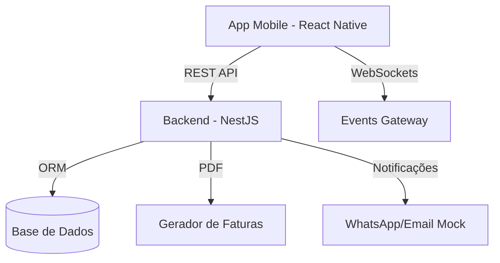

# 🍕 Pizzaria Rural — Experiência Premium de Encomenda de Pizza

[](backend/)
[](app-mobile/)
[](infra/)
[](LICENSE)

A **Pizzaria Rural** é uma plataforma de e-commerce de última geração para uma das pizzarias mais tradicionais da região. Combinando um design minimalista "Vercel-style" com a robustez de um backend industrial, o projeto oferece uma jornada de utilizador fluida, desde a seleção da massa até ao tracking em tempo real.

---

## 📖 Índice
- [Objetivos e Funcionalidades](#-objetivos-e-funcionalidades)
- [Estado do Projeto](#-estado-do-projeto)
- [Tecnologias Utilizadas](#-tecnologias-utilizadas)
- [Arquitetura do Sistema](#-arquitetura-do-sistema)
- [Instalação e Execução](#-instalação-e-execução)
- [Estrutura de Pastas](#-estrutura-de-pastas)
- [Galeria Visual](#-galeria-visual)
- [Roadmap e Melhorias](#-roadmap-e-melhorias)

---

## 🎯 Objetivos e Funcionalidades

### Funcionalidades Existentes ✅
- **Autenticação Segura:** Sistema de Login/Registo com JWT e Roles (Admin/Cliente).
- **Menu Dinâmico:** Listagem de pizzas com categorias, destaques e detalhes.
- **Carrinho Inteligente:** Gestão de itens com persistência local (Zustand + AsyncStorage).
- **Faturação Automática:** Geração de faturas em PDF após cada encomenda bem-sucedida.
- **Painel Administrativo:** CRUD de produtos integrado na App para gestores.
- **Sistema de Fidelidade:** Acumulação de pontos (1€ = 1 ponto) para descontos futuros.

### Funcionalidades em Falta / Em Desenvolvimento ⏳
- **Checkout Integrado:** Atualmente o checkout simula a finalização (Mock).
- **Configurador de Pizza:** Seleção de tamanhos e massas (UI em progresso).
- **Chat de Suporte Real:** Interface pronta, integração com backend pendente.
- **Tracking GPS:** Mapa funcional com pins, mas sem atualização real via WebSocket no Mobile.

---

## 🛠️ Tecnologias Utilizadas

| Componente | Tecnologias |
| :--- | :--- |
| **Backend** | NestJS, Prisma ORM, Socket.io, PDFKit, Winston, Passport (JWT) |
| **Frontend** | React Native (Expo), Zustand, Moti (Animations), React Navigation |
| **Base de Dados** | SQLite (Dev), PostgreSQL (Prod) |
| **Infraestrutura** | Docker, GitHub Actions, Prometheus, Grafana |

---

## 🏗️ Arquitetura do Sistema

O sistema segue uma arquitetura modular inspirada em microserviços, mas otimizada para um monorepo de fácil manutenção.



---

## 🚀 Instalação e Execução

### Requisitos
- Node.js >= 20
- Docker & Docker Compose (Opcional para monitorização)

### Backend
1. `cd backend`
2. `npm install`
3. `cp .env.example .env` (Configurar DATABASE_URL)
4. `npx prisma db push`
5. `npm run start:dev`

### Frontend
1. `cd app-mobile`
2. `npm install`
3. `npx expo start`

---

## 📁 Estrutura de Pastas

```text
.
├── app-mobile/         # Aplicação React Native (Expo)
│   ├── src/components/ # Componentes UI reutilizáveis
│   ├── src/screens/    # Ecrãs da aplicação
│   └── src/store/      # Gestão de estado (Zustand)
├── backend/            # API NestJS
│   ├── src/modules/    # Módulos de negócio (Orders, Pizzas, Auth)
│   └── prisma/         # Schema e Migrações
├── docs/               # Documentação técnica e Auditorias
├── infra/              # Scripts de DevOps e Monitorização
└── e2e/                # Testes End-to-End (Playwright)
```

---

## 🖼️ Galeria Visual

Aqui podes ver a aplicação em ação (Screenshots capturados em Janeiro 2026):

| Home | Menu | Detalhe |
| :---: | :---: | :---: |
|  |  |  |

| Checkout | Tracking | Conta |
| :---: | :---: | :---: |
|  |  |  |

---

## ⚠️ Problemas Conhecidos e Melhorias

Consulte o nosso relatório de [Auditoria Técnica](docs/AUDITORIA_TECNICA.md) para detalhes profundos sobre dívida técnica e bugs identificados.

### Principais Prioridades:
1. **Remoção de Mocks:** Substituir `setTimeout` por chamadas reais de API no Checkout.
2. **Robustez de Pagamentos:** Implementar Webhooks reais para Stripe/MBWay.
3. **Escalabilidade:** Migrar Base de Dados para PostgreSQL em Managed Service.

---

## 🗺️ Roadmap Sugerido

1. **V1.1:** Integração total do Checkout e Tracking WebSockets.
2. **V1.2:** Lançamento do Configurador de Massas/Tamanhos.
3. **V2.0:** Motor de Recomendações baseado em IA para sugestão de pizzas.

---
*Desenvolvido com rigor e paixão pela equipa Pizzaria Rural.*
