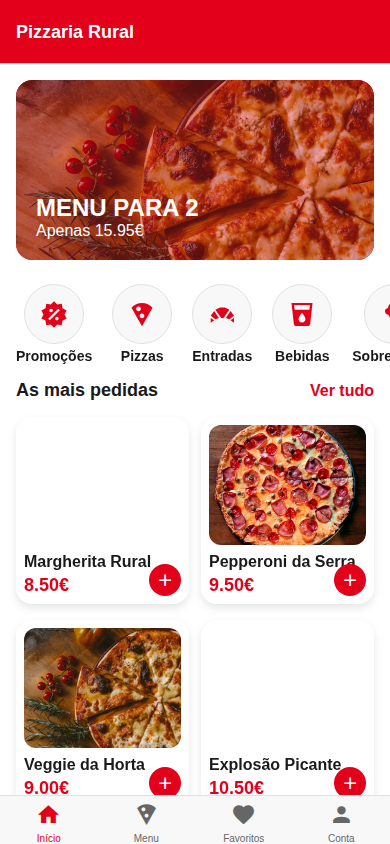

# 🍕 Pizzaria Rural — Do Campo para a sua Mesa

Uma aplicação mobile premium feita com **React Native (Expo)** para uma experiência autêntica de pedir pizzas tradicionais. Este projeto foi desenvolvido de forma colaborativa por 3 agentes de IA especializados.

## 🚀 Jornada do Utilizador (Tour Visual)

Abaixo pode ver o fluxo completo da aplicação, desde a descoberta até à entrega.

### 1. Início e Menu
<table>
  <tr>
    <td> <b>Início:</b> Visual Telepizza Style</td>
    <td> <b>Menu:</b> Grelha de produtos</td>
  </tr>
</table>

### 2. Personalização Avançada (Configurador)
<table>
  <tr>
    <td> <b>Passo 1:</b> Escolha do tamanho</td>
    <td> <b>Passo 2:</b> Tipo de massa</td>
  </tr>
</table>

### 3. Checkout e Fidelidade
<table>
  <tr>
    <td> <b>Checkout:</b> Cupões e Descontos</td>
    <td> <b>Tracking:</b> Mapa e Progresso</td>
  </tr>
</table>

---

## 🛠️ Stack Tecnológica
- **Frontend:** React Native, Expo, Moti, Zustand.
- **Backend:** NestJS, Prisma, PostgreSQL.
- **Infra:** GitHub Actions, Docker, Vercel.

## 🤖 Coordenação Multi-Agente
Este projeto utiliza um sistema de **Master Prompt** e **AGENTS.md** para garantir que Agentes de Frontend, Backend e Infraestrutura colaborem sem conflitos.

| Agente | Foco | Status |
| :--- | :--- | :--- |
| **Agente 1** | Frontend & UX | 100% ✅ |
| **Agente 2** | API & Lógica | 100% ✅ |
| **Agente 3** | Infra & QA | 92% ⏳ |

---
*Pizzaria Rural — Sabor tradicional com tecnologia moderna.*
