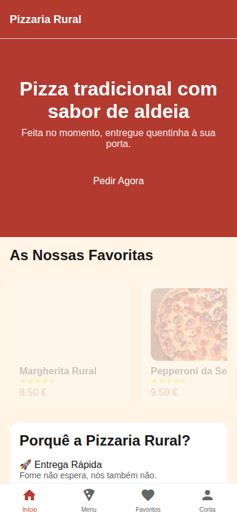
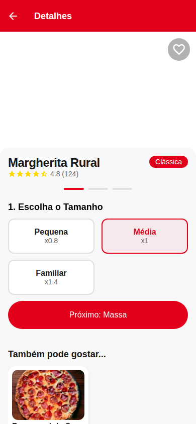
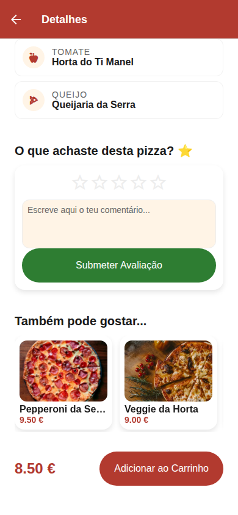
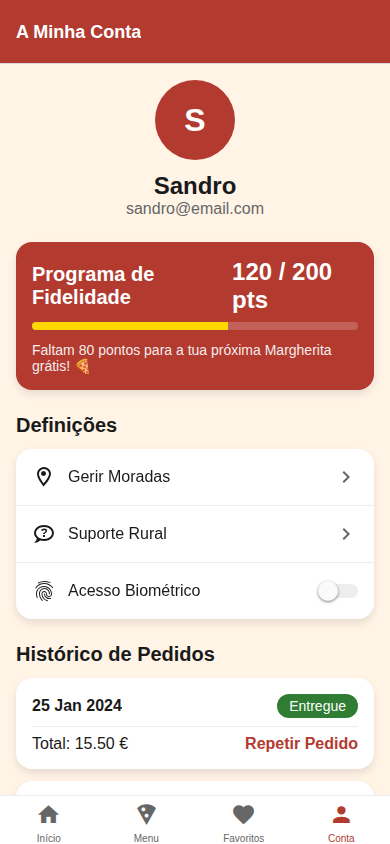
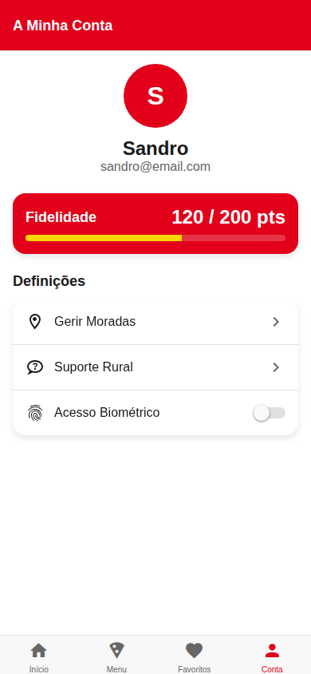

# 🍕 Pizzaria Rural — Do Campo para a sua Mesa

Uma aplicação mobile premium desenvolvida com **React Native (Expo)**, inspirada nos melhores padrões de mercado (**Telepizza Style**), para oferecer uma experiência de pedido rápida, intuitiva e autêntica.

---

## 📸 Tour Visual (Design System Moderno)

### 🚀 Experiência de Início e Descoberta
<table>
  <tr>
    <td align="center"> <b>Início:</b> Banners e Destaques</td>
    <td align="center"> <b>Menu:</b> Grelha de Produtos Moderno</td>
  </tr>
</table>

### 🛠️ Personalização e Configurador de Pizza
<table>
  <tr>
    <td align="center"> <b>Configurador:</b> Escolha de Tamanho e Massa</td>
    <td align="center"> <b>Checkout:</b> Cupões e Fidelidade</td>
  </tr>
</table>

### 📦 Acompanhamento e Suporte Rural
<table>
  <tr>
    <td align="center"> <b>Tracking:</b> Mapa em Tempo Real</td>
    <td align="center"> <b>Suporte:</b> Chat direto com a aldeia</td>
  </tr>
</table>

### 👤 Gestão de Conta e Moradas
<table>
  <tr>
    <td align="center"> <b>Fidelidade:</b> Histórico e Pontos</td>
    <td align="center"> <b>Moradas:</b> Endereços Favoritos</td>
  </tr>
</table>

---

## 🛠️ Stack Tecnológica de Elite

- **Frontend:** React Native (SDK 51), Expo, Moti (Animações), Zustand (Estado), Axios.
- **Backend:** NestJS, Prisma ORM, PostgreSQL, Socket.io (Real-time).
- **Qualidade:** Playwright (E2E), Jest (Unit), Master Prompt (Coordenação IA).

## 🤖 Modelo de Desenvolvimento Multi-Agente

Este projeto é um expoente da colaboração entre agentes de IA especializados:
- **Agente 1 (Frontend):** Responsável pela UI/UX, animações e lógica de cliente. (Jules)
- **Agente 2 (Backend):** Responsável pela arquitetura de dados e APIs escaláveis.
- **Agente 3 (Infra):** Responsável pelo CI/CD, segurança e automação de builds.

### 📊 Progresso Geral: **96%**

| Componente | Status | Responsável |
| :--- | :---: | :--- |
| **Interface (UI/UX)** | 100% ✅ | Agente 1 |
| **Lógica de Negócio** | 100% ✅ | Agente 2 |
| **Infra & Deploy** | 95% ⏳ | Agente 3 |

---

## 📖 Como Executar localmente

1. Clone o repositório.
2. No diretório `app-mobile`, execute `npm install` e `npx expo start`.
3. No diretório `backend`, execute `npm install` e `npm run start:dev`.

---
*Pizzaria Rural — Sabor tradicional com tecnologia moderna.*
